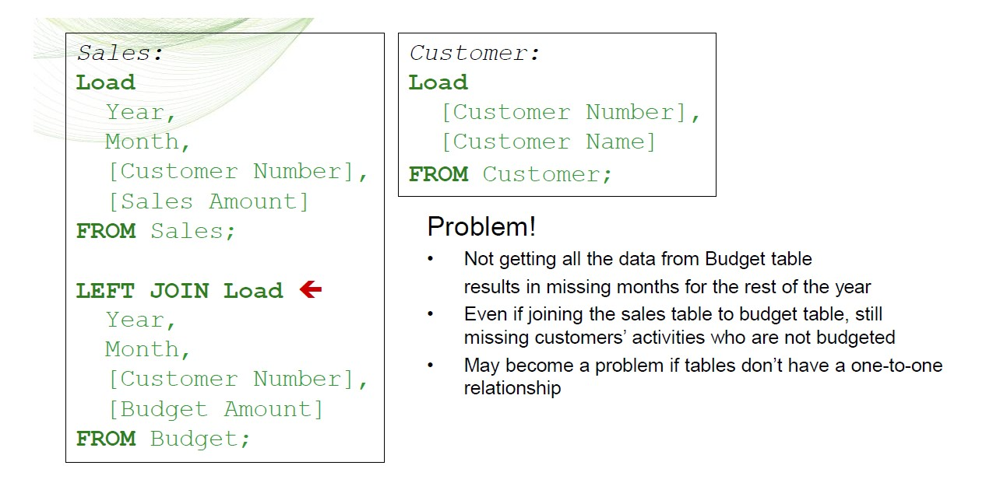
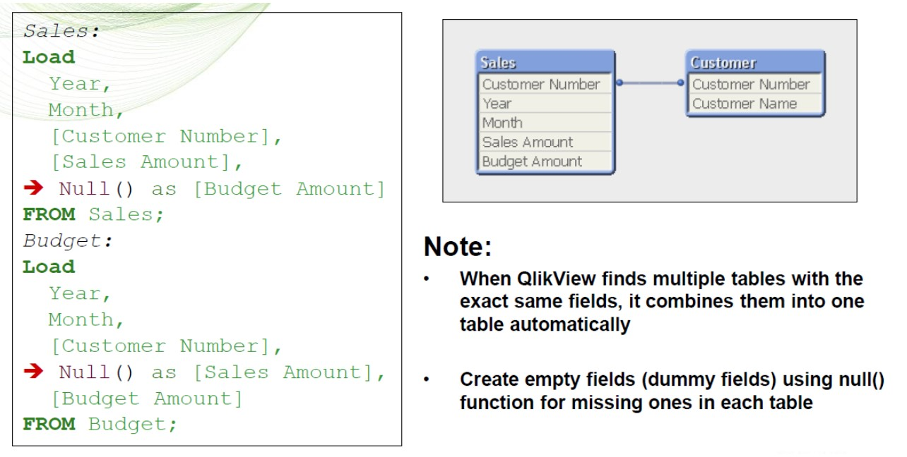

<h1 style="color:green">Section02-Data Modelling</h1>

------

**Links:**
  
  * <a href="https://community.qlik.com/t5/QlikView/ct-p/qlikview" target="_blank">Community</a>
  * [User Guide - Working with QlikView](https://help.qlik.com/en-US/qlikview/12.0/pdf/Working%20with%20QlikView.pdf)
  * [Help - Qlikview](https://help.qlik.com/en-US/qlikview/April2019/Content/QV_HelpSites/Home.htm)
  * [Help - Qlik Sense](https://help.qlik.com/en-US/sense/June2019/Content/Sense_Helpsites/Home.htm)
  * [Help - QlikView for Developers](https://help.qlik.com/en-US/qlikview-developer/April2019/Content/QV_HelpSites/Home-developer.htm)
  * [Recommended Learning Plan for QlikView Business Analysts](https://qcc.qlik.com/course/view.php?id=931)
  * [Business Analyst Library](https://qcc.qlik.com/course/view.php?id=284&section=2&_ga=2.1652917.509218995.1563026298-588683455.1563026298)

**Contents:**

  1. <a href="#Data_Model">QlikView Data Model</a>
  2. <a href="#General_Guidelines">General Guidelines</a>
  3. <a href="#Synthetic">Synthetic Keys</a>
  4. <a href="#Circular">Circular references</a>
  5. <a href="#StarSchema">The Star Schema</a>
  6. <a href="#Snowflake">The Snowflake Schema</a>
  7. <a href="#Linked_Table">Central Link Table (Event Space)</a>
 
------

<section id="Data_Model"></section>
<h3 style="color:green">QlikView Data Model</h3>

  * A QlikView data model is the representation of data you have loaded
  * When you load your data in to the QlikView application, a data model will be created based on the tables and columns you have in your script and also the names of the columns and any resident loads and joins you have previously defined.
  * These sources and the underling data will have to be manipulated within the script to deliver the Data Model that best suits your data for both performance and usability.  
  * QlikView allows you to see the results of a selection across the entire schema not just a limited subset of tables. 
  * QlikView will aggregate at the lowest level of granularity in the expression not the lowest level of granularity in the schema (query) like SQL.
  * Most common initial challenges : Synthetic keys and Circular references

<section id="General_Guidelines"></section>
<h3 style="color:green">General Guidelines</h3>

 Star & Snow Flake schemas work best in QlikView. Relational tables tend to have loops (circular references) and therefore do not work correctly when brought into QlikView.
  1. Aim for a star schema. Flaking is ok, but try to keep it to a minimum as it may impact performance adversely to have too many tables hanging off tables.
  2. When de-normalising data (rolling up) in order to reduce flaking, stop if de-normalising means replicating records millions of times the memory pointers required to store the same value enormous amounts of time now becomes significant. 
  3. For multifact solutions, analyse requirements to see if a concatenated solution meets the needs. If transaction record traceability is crucial, rather than analysis through association of common dimensions, then look at whether a link table would suit. If neither model is a good fit, a custom data model must be delivered through careful consideration of requirements and iterative delivery. It may incorporate elements of both link and concatenated tables.
  4. In larger environments whether from a data volume, complexity or concurrency of user perspective, efficient QlikView document design become increasingly important. To this aim, please utilise the tools at your disposal regarding performance testing.

<section id="Synthetic"></section>
<h3 style="color:green">Synthetic keys</h3>

  * It is a field that contains all possible combinations of common fields among tables
  * Multiple synthetic keys are often a symptom of an incorrect data model, but not necessarily. However, a sure sign of an incorrect data model is if you have synthetic keys based on other synthetic keys.

<h5 style="color:green">Q: How do I avoid a synthetic key? --JOIN</h5>

   * A: **Join** tables by common fields

<h5 style="color:green">Q: How do I avoid a synthetic key? --Create key</h5>

   * A: Create a **key** on your own by concatenating the common fields

<h5 style="color:green">Q: How do I avoid a synthetic key? --Auto concatenate</h5>

   * A: A: QlikView creates **empty fields automatically** so there is no need to create dummy fields manually

<h5 style="color:green">Q: How do I avoid a synthetic key? --Forced concatenate</h5>

   * A: Combine (**concatenate**) the tables so you have all the possible values

<section id="Circular"></section>
<h3 style="color:green">Circular references</h3>

  * Circular References are common in QlikView because you get only one set of join relationships per QlikView file.
  * When you get a circular reference ask yourself if you could live without one instance of the field that is causing the extra association (such as a duplicated field). If you can, rename it or remove it.  
  * Otherwise you may have to resort to concatenation or a link table to remove the circular reference. Don’t kill yourself with technical link tables if you don’t have to!
   
Can the Shippers Company Name just be renamed to reference it independently in order to remove the circular reference?

<section id="StarSchema"></section>
<h3 style="color:green">The Star Schema</h3>

  * The star schema (sometimes referenced as star join schema) is the simplest style of data warehouse schema. The star schema consists of a few fact tables (possibly only one, justifying the name) referencing any number of dimension tables. The star schema is considered an important special case of the snowflake schema.
  * The standard layout and structure of data presentation is the Star Schema. QlikView is generally most efficient when working in this space. 

  * This model works well in a simplistic, single event scenario . But as QlikView can handle multiple data sources from many different source systems and files, we have to work with multiple event scenarios, or many fact tables.

<section id="Snowflake"></section>
<h3 style="color:green">The Snowflake Schema</h3>

  * The snowflake schema is a variant of the star schema. Here, the centralized fact table is connected to multiple dimensions. In the snowflake schema, dimension are present in a normalized from in multiple related tables. The snowflake structure materialized when the dimensions of a star schema are detailed and highly structured, having several levels of relationship, and the child tables have multiple parent table. The snowflake effect affects only the dimension tables and does not affect the fact tables. 

<section id="Linked_Table"></section>
<h3 style="color:green">Central Link Table (Event Space)</h3>

  * In the event of multiple fact tables QlikView allows us to create a central link table that only contains the existing data combinations.
  * Instead of Joining the tables, the event dimensions can be **CONCATENATED** in to one central Link table.
  * This link table can then be linked back to the event measures one side and the dimension tables on the other.