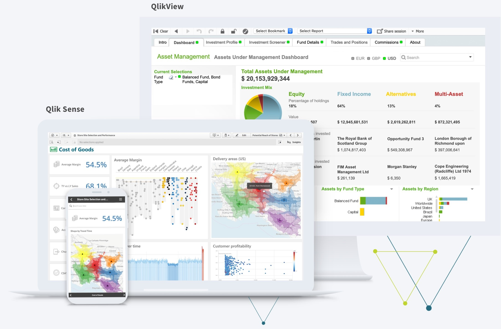
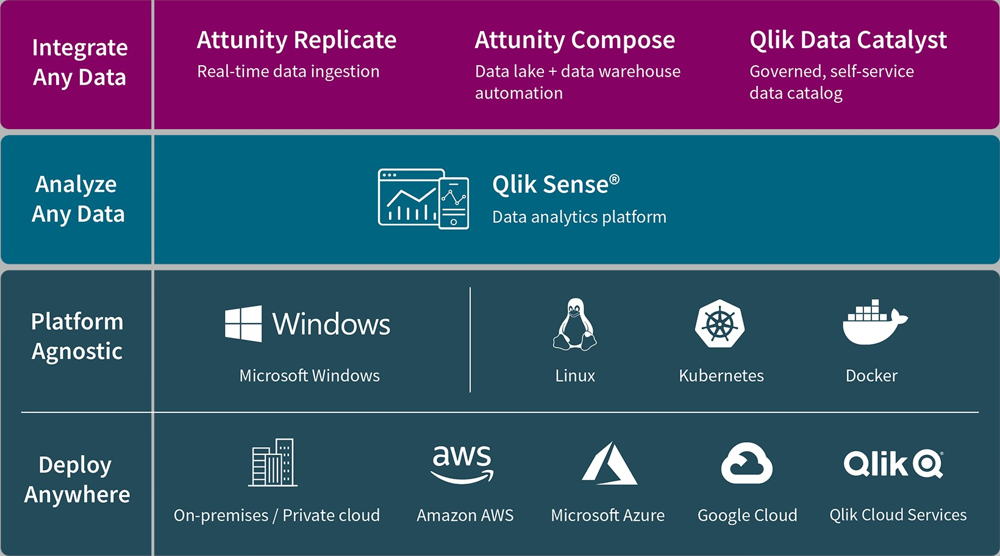
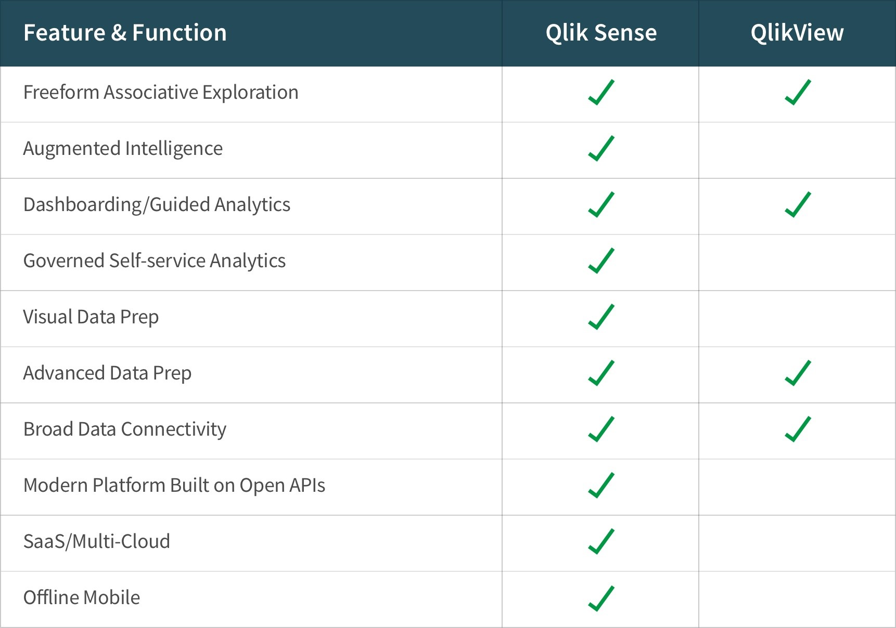

<h1 style="color:green">BI Tools</h1>

<h3 style="color:green">Qlikview®</h3>

QlikView lets you rapidly develop and deliver interactive guided analytics applications and dashboards. QlikView and the game-changing [Associative Engine](https://www.qlik.com/us/products/associative-difference) it is built on, revolutionized the way organizations use data, putting BI in the hands of more people than ever before.

<h3 style="color:green">Qlik Sense®</h3>

Qlik Sense® sets the benchmark for third-generation analytics platforms, empowering everyone in your organization to make data-driven decisions. 

Built on our unique Associative Engine, Qlik Sense offers industry-leading modern analytics capabilities across a full range of users and use cases — from self-service analytics to interactive dashboards and applications, conversational analytics, custom and embedded analytics, mobile analytics, and reporting. It augments and enhances human intuition with AI (artificial intelligence) powered insight suggestions, automation, and natural-language interaction. And it does all this within a governed SaaS / multi-cloud architecture that delivers trust, scale, and flexibility to your organization.

